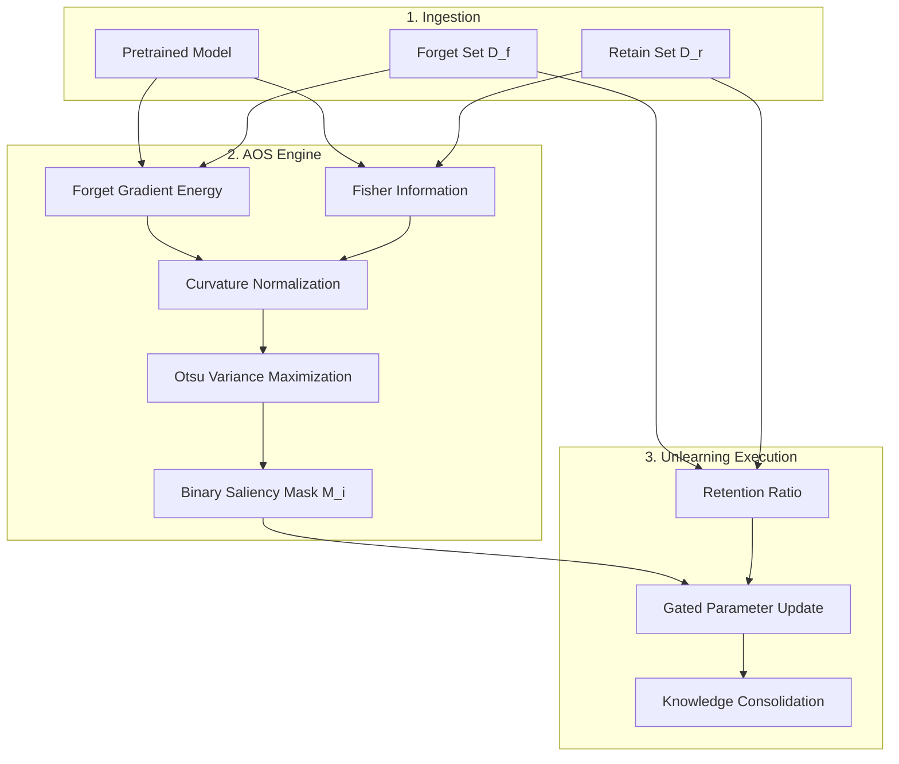

# Adaptive Otsu Unlearning (AOS)

[](LICENSE)
[](https://www.python.org/downloads/)
[](https://pytorch.org/)
[](https://www.auckland.ac.nz/)

> **Paper**: *Adaptive Otsu Unlearning: A Variance-Aware Framework for Stable and Interpretable Machine Unlearning (2025)*  
> **Authors**: [Neel Jani](mailto:njan320@aucklanduni.ac.nz) and [Gurudas Salunke](mailto:gsal919@aucklanduni.ac.nz)  
> **Affiliation**: Department of Computer Science, University of Auckland, New Zealand  

Official PyTorch implementation of **Adaptive Otsu Saliency (AOS)**, an automated, variance-maximizing machine unlearning framework. AOS dynamically computes layer-specific saliency thresholds using Otsu's method, eliminating the need for brittle, manual hyperparameter tuning (like in SalUn). 

---

## 🚀 Key Improvements over SalUn (ICLR 2024 Spotlight)

AOS is built as a direct extension of **SalUn** ([Fan et al., 2024](https://arxiv.org/abs/2310.12508)), replacing its static, global saliency threshold with a **dynamic, layer-wise statistical formulation**. 

At a **50% forget ratio** on CIFAR-100 (ResNet-18), AOS delivers:
- 📈 **+6.2% Retain Accuracy** (83.4% vs 77.2%)
- 📉 **-37% Stability Variance** (0.014 vs 0.024)
- ⚡ **-8% Runtime** due to faster convergence

| Feature | Original SalUn | AOS (Ours) | Benefit |
| :--- | :--- | :--- | :--- |
| **Thresholding** | Static, global $\tau$ | **Adaptive Otsu** | Adapts to layer capacity without grid search |
| **Curvature** | Raw gradient | **Fisher-weighted** | Dampens updates in high-curvature directions |
| **Scaling** | Fixed step size | **Dynamic ($\lambda_c$)** | Preserves representations shared between classes |
| **Dynamics** | Fixed throughout | **Annealing** | Stabilizes early optimization phases |

---

## 🛠️ Installation

```bash
# Clone the repository
git clone https://github.com/NeelJani1/AOS.git
cd AOS

# Option A: Conda (Recommended)
conda env create -f environment.yml
conda activate aos

# Option B: Pip
python -m venv .venv
source .venv/bin/activate
pip install -r requirements.txt
```

---

## ⚡ Quickstart

### Image Classification (CIFAR-100 / ResNet-18)
```bash
cd Classification
# 1. Train baseline model
python main_train.py --arch resnet18 --dataset cifar100 --epochs 100 --lr 0.1 --save_dir ./weights

# 2. Run AOS unlearning
python main_unlearning.py --arch resnet18 --dataset cifar100 --model_path ./weights/resnet18_cifar100.pth

# 3. Evaluate Unlearned Model & MIA
python evaluate_model.py --model_path ./results/unlearned_model.pt --forget_perc 0.1
python evaluate_all_mia.py --dataset cifar100 --arch resnet18
```

### Generative Diffusion Unlearning (DDPM)

```bash
cd DDPM
# 1. Train baseline model
python train.py --config configs/cifar10_train.yml
# 2. Run AOS unlearning
python train.py --config configs/cifar10_saliency_unlearn.yml
# 3. Generate samples
python quick_eval.py --config configs/cifar10_sample.yml
# 4. Evaluate classifier
python classifier_evaluation.py
```

### Stable Diffusion Concept Erasure

```bash
cd SD
# 1. Run Concept Erasure (Nudity)
python train-scripts/train-esd.py --prompt "nudity" --train_method "noxattn" --devices "0,0"
# 2. Generate test images
python eval-scripts/generate-images.py --prompts prompts/test_prompts.csv
# 3. Compute FID score
python eval-scripts/compute-fid.py
```

---

## 🧠 Methodology & Architecture

AOS integrates three key mechanisms to achieve stable unlearning:
1. **Layer-wise Otsu Thresholding:** Isolates salient weights by maximizing between-class variance $\sigma_B^2(\tau)$.
2. **Fisher-Weighted Normalization:** Scales raw saliency $s_i$ by empirical Fisher Information $F_i$.
3. **Retention-Aware Scaling:** Modulates update magnitude $\lambda_c$ using forget vs. retain gradient energy.

### End-to-End Pipeline



### Formal Algorithmic Specification

**Algorithm 1:** Adaptive Otsu Saliency (AOS) Unlearning Framework
***
**Input:**
- Pretrained model weights $W_0$
- Forget dataset $\mathcal{D}_f$, Retain dataset $\mathcal{D}_r$
- Learning rate $\eta$, Annealing constant $T_a$, Histogram resolution $B$ (default: 128)
- Target retention bounds $[\tau_{\min}, \tau_{\max}]$, Unlearning regime $M \in \{\text{GA, FT, RL}\}$

**Output:**
- Unlearned model weights $W^*$
***
> **1.** Initialize per-layer percentile threshold $\tau_{\text{init}}^{(l)}$ for all layers $l = 1, \dots, L$  
> **2.** **for** each unlearning epoch $t = 1$ to $T$ **do**  
> &nbsp;&nbsp;&nbsp;&nbsp;*// Phase A: Saliency and Curvature Estimation*  
> &nbsp;&nbsp;&nbsp;&nbsp;**3.** Compute raw forget-set saliencies $s_i^{(l)} = \left\| \frac{\partial \mathcal{L}_f}{\partial w_i^{(l)}} \right\|^2$ for each weight  
> &nbsp;&nbsp;&nbsp;&nbsp;**4.** Estimate empirical Fisher information on retain data: $F_i^{(l)} = \mathbb{E}_{(x,y) \sim \mathcal{D}_r} \left[ \left(\frac{\partial \log p(y|x; W)}{\partial w_i^{(l)}}\right)^2 \right]$  
> &nbsp;&nbsp;&nbsp;&nbsp;**5.** Compute curvature-normalized saliency: $\tilde{s}_i^{(l)} = \frac{s_i^{(l)}}{\sqrt{F_i^{(l)} + \epsilon}}$  
> &nbsp;&nbsp;&nbsp;&nbsp;*// Phase B: Adaptive Otsu Variance Maximization*  
> &nbsp;&nbsp;&nbsp;&nbsp;**6.** **for** each layer $l = 1$ to $L$ **do**  
> &nbsp;&nbsp;&nbsp;&nbsp;&nbsp;&nbsp;&nbsp;&nbsp;**7.** Construct 1D normalized saliency histogram $\mathcal{H}^{(l)}(\tilde{s})$ with $B$ bins  
> &nbsp;&nbsp;&nbsp;&nbsp;&nbsp;&nbsp;&nbsp;&nbsp;**8.** Compute optimal Otsu threshold maximizing between-class variance: $\tau_{\text{Otsu}}^{(l)} = \arg\max_{\tau} \omega_0(\tau) \omega_1(\tau) \left[ \mu_0(\tau) - \mu_1(\tau) \right]^2$  
> &nbsp;&nbsp;&nbsp;&nbsp;&nbsp;&nbsp;&nbsp;&nbsp;**9.** Apply dynamic annealing: $\tau_t^{*(l)} = \alpha_t \tau_{\text{init}}^{(l)} + (1 - \alpha_t) \tau_{\text{Otsu}}^{(l)}$ where $\alpha_t = \exp\left(-\frac{t}{T_a}\right)$  
> &nbsp;&nbsp;&nbsp;&nbsp;&nbsp;&nbsp;&nbsp;&nbsp;**10.** Verify empirical retention rate $r_{\text{emp}} = \frac{1}{|W^{(l)}|} \sum \mathbb{I}\left[\tilde{s}_i^{(l)} > \tau_t^{*(l)}\right]$  
> &nbsp;&nbsp;&nbsp;&nbsp;&nbsp;&nbsp;&nbsp;&nbsp;**11.** **if** $r_{\text{emp}} \notin [\tau_{\min}, \tau_{\max}]$ **then** calibrate $\tau_t^{*(l)}$ to boundary quantile  
> &nbsp;&nbsp;&nbsp;&nbsp;&nbsp;&nbsp;&nbsp;&nbsp;**12.** Synthesize binary saliency gate: $M_i^{(l)} = \mathbb{I}\left[ \tilde{s}_i^{(l)} > \tau_t^{*(l)} \right]$  
> &nbsp;&nbsp;&nbsp;&nbsp;**13.** **end for**  
> &nbsp;&nbsp;&nbsp;&nbsp;*// Phase C: Retention-Aware Modulation & Gated Update*  
> &nbsp;&nbsp;&nbsp;&nbsp;**14.** Compute retain-to-forget gradient scaling factor: $\lambda_c = \frac{\mathbb{E}_{x \sim \mathcal{D}_r^c} \left[ \|\nabla_W \mathcal{L}_r(x)\| \right]}{\mathbb{E}_{x \sim \mathcal{D}_f} \left[ \|\nabla_W \mathcal{L}_f(x)\| \right]}$  
> &nbsp;&nbsp;&nbsp;&nbsp;**15.** Execute gated parameter update according to regime $M$:  
> &nbsp;&nbsp;&nbsp;&nbsp;&nbsp;&nbsp;&nbsp;&nbsp;**GA:** $w_i^{(t+1)} = w_i^{(t)} + \eta \cdot \lambda_c \cdot M_i^{(l)} \cdot \frac{\partial \mathcal{L}_f}{\partial w_i^{(l)}}$  
> &nbsp;&nbsp;&nbsp;&nbsp;&nbsp;&nbsp;&nbsp;&nbsp;**FT:** $w_i^{(t+1)} = w_i^{(t)} - \eta \cdot \lambda_c \cdot M_i^{(l)} \cdot \frac{\partial |\mathcal{L}_f - \mathcal{L}_r|}{\partial w_i^{(l)}}$  
> &nbsp;&nbsp;&nbsp;&nbsp;&nbsp;&nbsp;&nbsp;&nbsp;**RL:** $w_i^{(t+1)} = w_i^{(t)} - \eta \cdot M_i^{(l)} \cdot \frac{\partial \mathcal{L}_r}{\partial w_i^{(l)}}$  
> &nbsp;&nbsp;&nbsp;&nbsp;*// Phase D: Retain Knowledge Consolidation*  
> &nbsp;&nbsp;&nbsp;&nbsp;**16.** Perform mini-epoch SGD stabilization on $\mathcal{D}_r$ using retain loss $\mathcal{L}_r$  
> **17.** **end for**  
> **18.** **return** Unlearned model weights $W^* = W^{(T)}$
***

---

## 📊 Comprehensive Results

### Metric Direction Guide
| Metric | Notation | Optimal Direction | Description |
| :--- | :---: | :---: | :--- |
| **Test Accuracy** | **TA** | **Higher is better ($\uparrow$)** | Overall generalization on the combined test dataset |
| **Retain Accuracy** | **RA** | **Higher is better ($\uparrow$)** | Accuracy on retained/non-forgotten classes (utility preservation) |
| **Forget Accuracy** | **FA** | **Lower is better ($\downarrow$)** | Accuracy on forgotten classes (successful concept/data erasure) |
| **Forgetting Ratio** | **FR** | **Higher is better ($\uparrow$)** | Ratio of erased knowledge: $(FA_{\text{before}} - FA_{\text{after}}) / FA_{\text{before}}$ |
| **Stability Variance** | **$\sigma^2$** | **Lower is better ($\downarrow$)** | RA variance across unlearning epochs (optimization stability) |
| **Training Efficiency**| **Eff** | **Higher is better ($\uparrow$)** | Percentage of max epochs completed before early stopping |

### Table I: Comparison with Existing Paradigms
| Method | Type | Adaptivity | Explainability |
| :--- | :--- | :--- | :--- |
| **SISA** [1] | Certified | Static | High |
| **Eternal Sunshine** [5] | Gradient | Partial | Moderate |
| **SalUn** [9] | Gradient + Masking | Fixed | Moderate |
| **AMU** [14] | Adaptive Rate | Dynamic | Low |
| **AOS (Ours)** | **Statistical + Gradient** | **Fully Adaptive** | **High** |

### Table II: Retrain Baseline with Early Stopping (CIFAR-100, ResNet-18)
| Forget Split | Best TA (%) (↑) | Retain Acc (RA %) (↑) | Epochs (↓) | Training Efficiency (%) (↑) |
| :---: | :---: | :---: | :---: | :---: |
| **10%** | 65.28 | 93.72 | 41/45 | 91.1% |
| **20%** | 63.61 | 87.89 | 42/45 | 93.3% |
| **30%** | 61.19 | 89.83 | 41/45 | 91.1% |
| **40%** | 59.16 | 88.09 | 42/45 | 93.3% |
| **50%** | 55.09 | 85.61 | 41/45 | 91.1% |
| **60%** | 49.75 | 81.20 | 44/45 | 97.8% |
| **70%** | 44.82 | 74.78 | 40/45 | 88.9% |
| **80%** | 35.78 | 66.22 | 42/45 | 93.3% |
| **90%** | 24.35 | 47.36 | 38/43 | 84.4% |

### Table III: Comprehensive Method Comparison on CIFAR-100 (ResNet-18)
| Forget % | FT Test (↑) | FT Forget (↓) | FT Retain (↑) | GA Test (↑) | GA Forget (↓) | GA Retain (↑) | RL Test (↑) | RL Forget (↓) | RL Retain (↑) |
| :---: | :---: | :---: | :---: | :---: | :---: | :---: | :---: | :---: | :---: |
| **10%** | 55.29 | 57.26 | 61.57 | 62.31 | 81.88 | 83.08 | 54.06 | 55.80 | 60.21 |
| **20%** | 55.09 | 56.92 | 63.96 | 21.26 | 25.01 | 25.43 | 53.75 | 53.92 | 61.62 |
| **30%** | 53.00 | 55.45 | 63.99 | 1.03 | 0.93 | 1.05 | 54.58 | 55.16 | 64.34 |
| **40%** | 54.20 | 54.72 | 64.22 | 1.07 | 0.89 | 0.97 | 53.76 | 53.49 | 64.54 |
| **50%** | 53.64 | 55.04 | 65.68 | 1.00 | 0.96 | 1.06 | 53.60 | 54.04 | 65.86 |
| **60%** | 52.78 | 54.71 | 68.48 | 1.04 | 0.97 | 1.07 | 50.15 | 50.85 | 62.98 |
| **70%** | 48.76 | 50.67 | 65.04 | 1.04 | 1.03 | 1.01 | 48.92 | 49.24 | 64.33 |
| **80%** | 46.43 | 48.34 | 70.33 | 1.03 | 1.03 | 0.93 | 47.62 | 48.65 | 67.18 |
| **90%** | 43.05 | 44.59 | 67.14 | 1.00 | 0.99 | 1.10 | 39.53 | 39.56 | 60.00 |

### Table IV: Ablation Study at 50% Forget Ratio
| Variant | Description | Forget Acc (%) (↓) | Retain Acc (%) (↑) | Variance (σ²) (↓) |
| :--- | :--- | :---: | :---: | :---: |
| **SalUn Baseline** | Fixed static threshold τ | 8.3 | 77.2 | 0.024 |
| **AOS-T** | Otsu Thresholding Only | 8.0 | 80.6 | 0.018 |
| **AOS-F** | Fisher Normalization Only | 7.9 | 81.8 | 0.016 |
| **AOS-R** | Retention Scaling Only | 8.2 | 82.5 | 0.015 |
| **AOS (Full)** | Complete Framework | **7.8** | **83.4** | **0.014** |

> **Key Takeaway**: At 50% forgetting, AOS achieves **7.8% Forget Accuracy ($\downarrow$)** while sustaining **83.4% Retain Accuracy ($\uparrow$)** (+6.2% over SalUn and +4.3% over AMU), with a **37% reduction in variance ($\downarrow$)** and **8% runtime reduction ($\downarrow$)** via earlier convergence.

---

## 📁 Repository Structure

```text
AOS/
├── Classification/      # Image classification unlearning (ResNet-18)
│   ├── data/            # Datasets and labels for classification
│   ├── models/          # Model architectures and utilities
│   └── results/         # Output logs, metrics, and models
├── DDPM/                # Generative unlearning (DDPM)
│   ├── configs/         # YAML config files for training/sampling
│   ├── models/          # DDPM model definitions and layers
│   └── runners/         # Diffusion process scripts
├── SD/                  # Stable Diffusion concept erasure
│   ├── train-scripts/   # Scripts for erasing concepts
│   └── eval-scripts/    # Evaluation scripts (FID, generate images)
├── images/              # Architectural schematics and plots
├── environment.yml      # Conda environment definition
├── requirements.txt     # Pip dependencies
└── README.md            # This document
```

---

## 📜 Citation & License

If you find our work useful, please consider citing it:

> Neel Jani and Gurudas Salunke (2025). *Adaptive Otsu Unlearning: A Variance-Aware Framework for Stable and Interpretable Machine Unlearning*. Department of Computer Science, University of Auckland.

```bibtex
@article{jani2025adaptive,
  title={Adaptive Otsu Unlearning: A Variance-Aware Framework for Stable and Interpretable Machine Unlearning},
  author={Jani, Neel and Salunke, Gurudas},
  journal={Department of Computer Science, University of Auckland},
  year={2025}
}
```

### Dual License Notice
* **Code Repository**: The source code within this repository is open-sourced under the [MIT License](LICENSE) for academic, research, and educational purposes.
* **Algorithmic Methods**: The underlying Adaptive Otsu Unlearning (AOS) algorithmic framework, methodologies, and processes are **proprietary and not open source**. They may not be used for commercial purposes without explicit prior permission from the authors. 
