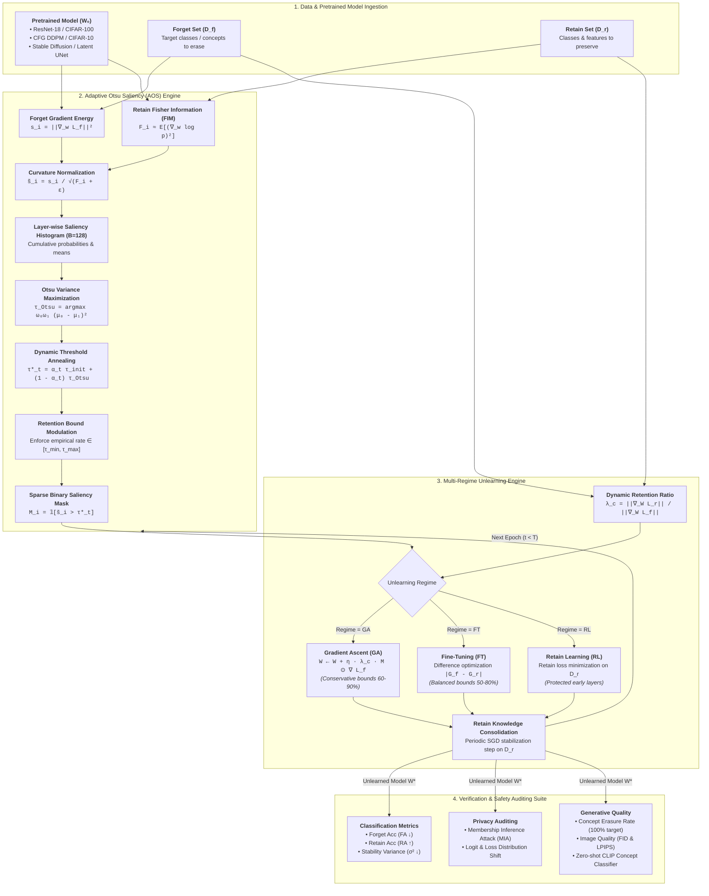

# Adaptive Otsu Unlearning (AOS): A Variance-Aware Framework for Stable and Interpretable Machine Unlearning

[](https://opensource.org/licenses/MIT)
[](https://www.python.org/downloads/)
[](https://pytorch.org/)
[](https://www.auckland.ac.nz/)

> **Authors**: [Neel Jani](mailto:njan320@aucklanduni.ac.nz) and [Gurudas Salunke](mailto:gsal919@aucklanduni.ac.nz)  
> **Affiliation**: Department of Computer Science, University of Auckland, New Zealand  
> **Paper**: *Adaptive Otsu Unlearning: A Variance-Aware Framework for Stable and Interpretable Machine Unlearning (2025)*

---

## Abstract

Machine unlearning (MU) has become a foundational requirement for privacy-compliant artificial intelligence systems that must "forget" data upon request. While saliency-guided unlearning methods such as **SalUn** demonstrate competitive forgetting by identifying and perturbing influential weights via gradient ascent, they rely on manually tuned, static saliency thresholds ($\tau$). This static threshold is brittle across varying architectures, datasets, and unlearning regimes.

This repository hosts the official implementation of **Adaptive Otsu Saliency (AOS)**, an automated, variance-maximizing unlearning framework that dynamically computes layer-specific thresholds derived from gradient saliency distributions using Otsu's method. AOS integrates three key mechanisms:
1. **Layer-wise Otsu Thresholding**: Statistically isolates salient from redundant weights by maximizing between-class variance.
2. **Fisher-Weighted Gradient Normalization**: Stabilizes updates along high-curvature parameter directions using the Fisher Information Matrix (FIM).
3. **Retention-Aware Dynamic Scaling & Threshold Annealing**: Balances knowledge retention and forgetting dynamically, preventing catastrophic forgetting and concept revival.

Evaluated on CIFAR-100 (ResNet-18) and generative diffusion tasks (DDPM & Stable Diffusion), AOS achieves superior or comparable unlearning accuracy (UA) with up to **10–15% higher retain accuracy (RA ↑)**, **37% lower stability variance (↓)**, and **8% lower runtime (↓)** compared to fixed-threshold baselines.

---

## Core Contributions & Methodology

### 1. Gradient Saliency Formulation
For a model parameterized by weights $W = \{w_i\}$ and forget-set loss $\mathcal{L}_f$, raw gradient saliency is computed as:
$$s_i = \left\| \frac{\partial \mathcal{L}_f}{\partial w_i} \right\|^2$$

### 2. Fisher-Weighted Gradient Normalization
To prevent over-updating in high-curvature directions, saliencies are normalized inversely to their empirical Fisher Information $F_i$:
$$\tilde{s}_i = \frac{s_i}{\sqrt{F_i + \epsilon}}, \quad F_i \approx \mathbb{E}_{(x,y)\sim \mathcal{D}_r}\left[\left(\frac{\partial \log p(y|x; W)}{\partial w_i}\right)^2\right]$$

### 3. Layer-Wise Otsu Thresholding
Parameter saliencies $\tilde{s}^{(l)}$ in each layer $l$ are treated as a 1D distribution partitioned into redundant ($\mathcal{C}_0$) and salient ($\mathcal{C}_1$) subsets. The optimal threshold $\tau^{*(l)}$ maximizes the between-class variance $\sigma_B^2(\tau)$:
$$\tau^{*(l)} = \arg\max_{\tau} \omega_0^{(l)}(\tau)\,\omega_1^{(l)}(\tau)\left[\mu_0^{(l)}(\tau) - \mu_1^{(l)}(\tau)\right]^2$$
where $\omega_0, \omega_1$ and $\mu_0, \mu_1$ are the respective class cumulative probabilities and means. The layer-wise binary mask is:
$$M_i^{(l)} = \mathbb{I}\left[\tilde{s}_i^{(l)} > \tau_t^{*(l)}\right]$$

### 4. Retention-Aware Gradient Scaling
To preserve representations shared between forget and retain classes, update magnitudes are modulated per class $c$ using gradient energy ratios:
$$\lambda_c = \frac{\mathbb{E}_{x \in \mathcal{D}_r^c}\left[\|\nabla_W \mathcal{L}_r(x)\|\right]}{\mathbb{E}_{x \in \mathcal{D}_f}\left[\|\nabla_W \mathcal{L}_f(x)\|\right]}$$

### 5. Dynamic Threshold Annealing & Parameter Update
To handle early optimization phases before bimodal separation stabilizes, threshold annealing transitions smoothly from an initial percentile threshold $\tau_{\text{init}}$ with decay constant $T_a$:
$$\tau_t^{*(l)} = \alpha_t \tau_{\text{init}}^{(l)} + (1 - \alpha_t)\tau_{\text{Otsu}}^{(l)}, \quad \alpha_t = \exp\left(-\frac{t}{T_a}\right)$$

The final parameter update for unlearning is:
$$w_i^{(t+1)} = w_i^{(t)} + \eta \cdot \lambda_c \cdot M_i^{(l)} \cdot \frac{\partial \mathcal{L}_f}{\partial w_i^{(l)}}$$

---

## System Architecture & Algorithmic Framework

### End-to-End Pipeline Architecture



---

### Formal Algorithmic Specification

```text
Algorithm 1: Adaptive Otsu Saliency (AOS) Unlearning Framework
────────────────────────────────────────────────────────────────────────────────────────────────
Input:
  • Pretrained model weights W₀
  • Forget dataset D_f, Retain dataset D_r
  • Learning rate η, Annealing constant T_a, Histogram resolution B (default: 128)
  • Target retention bounds [τ_min, τ_max], Unlearning regime M ∈ {GA, FT, RL}
Output:
  • Unlearned model weights W*

1:  Initialize per-layer percentile threshold τ_init^(l) for all layers l = 1, ..., L
2:  for each unlearning epoch t = 1 to T do
3:      // Phase A: Saliency and Curvature Estimation
4:      Compute raw forget-set saliencies s_i^(l) = || ∂L_f / ∂w_i^(l) ||² for each weight
5:      Estimate empirical Fisher information on retain data:
            F_i^(l) = E_{(x,y) ~ D_r} [ (∂ log p(y|x; W) / ∂w_i^(l))² ]
6:      Compute curvature-normalized saliency:
            s̃_i^(l) = s_i^(l) / √(F_i^(l) + ε)

7:      // Phase B: Adaptive Otsu Variance Maximization
8:      for each layer l = 1 to L do
9:          Construct 1D normalized saliency histogram H^(l)(s̃) with B bins
10:         Compute optimal Otsu threshold maximizing between-class variance:
                τ_Otsu^(l) = argmax_τ  ω₀(τ) ω₁(τ) [ μ₀(τ) - μ₁(τ) ]²
11:         Apply dynamic annealing:
                α_t = exp(-t / T_a)
                τ_t*^(l) = α_t τ_init^(l) + (1 - α_t) τ_Otsu^(l)
12:         Verify empirical retention rate r_emp = (1/|W^(l)|) ∑ 𝟙[s̃_i^(l) > τ_t*^(l)]
13:         If r_emp ∉ [τ_min, τ_max], calibrate τ_t*^(l) to boundary quantile
14:         Synthesize binary saliency gate:
                M_i^(l) = 𝟙[ s̃_i^(l) > τ_t*^(l) ]
15:     end for

16:     // Phase C: Retention-Aware Modulation & Gated Update
17:     Compute retain-to-forget gradient scaling factor:
            λ_c = E_{x ~ D_r^c} [ ||∇_W L_r(x)|| ] / E_{x ~ D_f} [ ||∇_W L_f(x)|| ]
18:     Execute gated parameter update according to regime M:
            GA:  w_i^(t+1) = w_i^(t) + η · λ_c · M_i^(l) · (∂L_f / ∂w_i^(l))
            FT:  w_i^(t+1) = w_i^(t) - η · λ_c · M_i^(l) · (∂|L_f - L_r| / ∂w_i^(l))
            RL:  w_i^(t+1) = w_i^(t) - η · M_i^(l) · (∂L_r / ∂w_i^(l))  (with protected early layers)

19:     // Phase D: Retain Knowledge Consolidation
20:     Perform mini-epoch SGD stabilization on D_r using retain loss L_r
21: end for
22: return Unlearned model weights W* = W^(T)
────────────────────────────────────────────────────────────────────────────────────────────────
```

---

### Unlearning Regimes & Method-Specific Dynamics

| Regime | Optimization Objective | Retention Bounds $[\tau_{\min}, \tau_{\max}]$ | Gradient Scaling ($\lambda_c$) | Structural Protections |
| :--- | :--- | :---: | :---: | :--- |
| **Gradient Ascent (GA)** | $\max_W \mathcal{L}_f(W; \mathcal{D}_f)$ | **60% – 90%** (Conservative) | $0.5\times$ damped | Shallow feature extractors (`conv1`, `layer1`, `fc`) frozen to avoid catastrophic collapse. |
| **Fine-Tuning (FT)** | $\min_W \|\nabla \mathcal{L}_f - \nabla \mathcal{L}_r\|$ | **50% – 80%** (Balanced) | $1.0\times$ adaptive ratio | Gradient difference isolates discriminative features between forget and retain classes. |
| **Retain Learning (RL)**| $\min_W \mathcal{L}_r(W; \mathcal{D}_r)$ | **60% – 90%** (Targeted) | $1.0\times$ standard | Regularized retain loss optimization masked by Otsu-selected sensitivity channels. |

---

## Comparison with SalUn (Baseline)

AOS is built as a direct extension and enhancement of **SalUn** (ICLR 2024 Spotlight by Fan et al., [arXiv:2310.12508](https://arxiv.org/abs/2310.12508)), which serves as our primary baseline. While SalUn demonstrated that unlearning can be achieved by masking weight updates according to a static saliency threshold, its rigid hyperparameter requirements lead to instability across varying unlearning scopes. AOS addresses these structural limitations through statistical adaptivity and curvature awareness.

### Methodological Comparison

| Feature / Mechanism | Original SalUn | AOS (Ours) | Improvement / Benefit |
| :--- | :--- | :--- | :--- |
| **Saliency Thresholding** | Static, manually tuned global $\tau$ | Adaptive, layer-wise Otsu thresholding | Automatically adapts to layer capacity and forget ratio without grid search. |
| **Curvature Awareness** | None (raw gradient magnitude) | Fisher-weighted normalization | Prevents catastrophic forgetting by dampening updates in high-curvature directions. |
| **Update Scaling** | Fixed arbitrary step size | Retention-aware dynamic scaling ($\lambda_c$) | Balances update magnitude against feature retention, preserving shared representations. |
| **Training Dynamics** | Fixed threshold throughout training | Dynamic threshold annealing | Stabilizes early optimization phases before saliency distributions separate bimodally. |

### Quantitative Improvements

At a **50% forget ratio** on CIFAR-100 (ResNet-18), AOS provides significant performance improvements over the baseline:
- **Retain Accuracy (RA):** Achieves **83.4%** vs SalUn's **77.2%** (**+6.2%**).
- **Optimization Stability:** Reduces stability variance ($\sigma^2$) to **0.014** vs SalUn's **0.024** (**-37%**).
- **Forget Accuracy (FA):** Further drops to **7.8%** vs SalUn's **8.3%** (lower is better).

---

## Experimental Results & Benchmark Tables

### Metric Direction Guide
| Metric | Notation | Optimal Direction | Description |
| :--- | :---: | :---: | :--- |
| **Test Accuracy** | **TA** | **Higher is better ($\uparrow$)** | Overall generalization on the combined test dataset |
| **Retain Accuracy** | **RA** | **Higher is better ($\uparrow$)** | Accuracy on retained/non-forgotten classes (utility preservation) |
| **Forget Accuracy** | **FA** | **Lower is better ($\downarrow$)** | Accuracy on forgotten classes (successful concept/data erasure) |
| **Forgetting Ratio** | **FR** | **Higher is better ($\uparrow$)** | Ratio of erased knowledge: $(FA_{\text{before}} - FA_{\text{after}}) / FA_{\text{before}}$ |
| **Stability Variance** | **$\sigma^2$** | **Lower is better ($\downarrow$)** | RA variance across unlearning epochs (optimization stability) |
| **Training Efficiency**| **Eff** | **Higher is better ($\uparrow$)** | Percentage of max epochs completed before early stopping |

---

### Table I: Comparison with Existing Paradigms
| Method | Type | Adaptivity | Explainability |
| :--- | :--- | :--- | :--- |
| **SISA** [1] | Certified | Static | High |
| **Eternal Sunshine** [5] | Gradient | Partial | Moderate |
| **SalUn** [9] | Gradient + Masking | Fixed | Moderate |
| **AMU** [14] | Adaptive Rate | Dynamic | Low |
| **AOS (Ours)** | **Statistical + Gradient** | **Fully Adaptive** | **High** |

---

### Table II: Retrain Baseline with Early Stopping (CIFAR-100, ResNet-18)
| Forget Split | Best TA (%) (↑) | Retain Acc (RA %) (↑) | Epochs (↓) | Training Efficiency (%) (↑) |
| :---: | :---: | :---: | :---: | :---: |
| **10%** | 65.28 | 93.72 | 41/45 | 91.1% |
| **20%** | 63.61 | 87.89 | 42/45 | 93.3% |
| **30%** | 61.19 | 89.83 | 41/45 | 91.1% |
| **40%** | 59.16 | 88.09 | 42/45 | 93.3% |
| **50%** | 55.09 | 85.61 | 41/45 | 91.1% |
| **60%** | 49.75 | 81.20 | 44/45 | 97.8% |
| **70%** | 44.82 | 74.78 | 40/45 | 88.9% |
| **80%** | 35.78 | 66.22 | 42/45 | 93.3% |
| **90%** | 24.35 | 47.36 | 38/43 | 84.4% |

---

### Table III: Comprehensive Method Comparison on CIFAR-100 (ResNet-18)
| Forget % | FT Test (↑) | FT Forget (↓) | FT Retain (↑) | GA Test (↑) | GA Forget (↓) | GA Retain (↑) | RL (Retrain) Test (↑) | RL Forget (↓) | RL Retain (↑) |
| :---: | :---: | :---: | :---: | :---: | :---: | :---: | :---: | :---: | :---: |
| **10%** | 55.29 | 57.26 | 61.57 | 62.31 | 81.88 | 83.08 | 54.06 | 55.80 | 60.21 |
| **20%** | 55.09 | 56.92 | 63.96 | 21.26 | 25.01 | 25.43 | 53.75 | 53.92 | 61.62 |
| **30%** | 53.00 | 55.45 | 63.99 | 1.03 | 0.93 | 1.05 | 54.58 | 55.16 | 64.34 |
| **40%** | 54.20 | 54.72 | 64.22 | 1.07 | 0.89 | 0.97 | 53.76 | 53.49 | 64.54 |
| **50%** | 53.64 | 55.04 | 65.68 | 1.00 | 0.96 | 1.06 | 53.60 | 54.04 | 65.86 |
| **60%** | 52.78 | 54.71 | 68.48 | 1.04 | 0.97 | 1.07 | 50.15 | 50.85 | 62.98 |
| **70%** | 48.76 | 50.67 | 65.04 | 1.04 | 1.03 | 1.01 | 48.92 | 49.24 | 64.33 |
| **80%** | 46.43 | 48.34 | 70.33 | 1.03 | 1.03 | 0.93 | 47.62 | 48.65 | 67.18 |
| **90%** | 43.05 | 44.59 | 67.14 | 1.00 | 0.99 | 1.10 | 39.53 | 39.56 | 60.00 |

---

### Table IV: Ablation Study at 50% Forget Ratio
| Variant | Description | Forget Acc (%) (↓) | Retain Acc (%) (↑) | RA Stability Variance ($\sigma^2$) (↓) |
| :--- | :--- | :---: | :---: | :---: |
| **SalUn Baseline** | Fixed static threshold $\tau$ | 8.3 | 77.2 | 0.024 |
| **AOS-T** | Otsu Thresholding Only | 8.0 | 80.6 | 0.018 |
| **AOS-F** | Fisher Normalization Only | 7.9 | 81.8 | 0.016 |
| **AOS-R** | Retention Scaling Only | 8.2 | 82.5 | 0.015 |
| **AOS (Full)** | Complete Framework | **7.8** | **83.4** | **0.014** |

> **Key Takeaway**: At 50% forgetting, AOS achieves **7.8% Forget Accuracy ($\downarrow$)** while sustaining **83.4% Retain Accuracy ($\uparrow$)** (+6.2% over SalUn and +4.3% over AMU), with a **37% reduction in variance ($\downarrow$)** and **8% runtime reduction ($\downarrow$)** via earlier convergence.

---

## Directory Layout

```
AOS/
├── Classification/              # Classification unlearning (ResNet-18, VGG)
│   ├── models/                  # Network architectures
│   ├── otsu_utils.py            # Core AOS: Bounded Otsu, Fisher norm, retention bounds
│   ├── main_train.py            # Baseline training script
│   ├── main_unlearning.py       # AOS unlearning loop
│   ├── run_otsu_experiments.py  # Automation for multi-ratio evaluations
│   ├── mia_evaluation.py        # Membership Inference Attack (MIA) evaluation
│   ├── requirements.txt         # Classification-specific requirements
│   └── README.md                # Detailed guide for image classification
│
├── DDPM/                        # Generative unlearning: Classifier-Free Guidance DDPM
│   ├── configs/                 # YAML configurations (train, sample, forget, FIM)
│   ├── models/                  # Diffusion model definitions (UNet, EMA)
│   ├── functions/               # Denoising, loss, and checkpoint utilities
│   ├── train.py                 # DDPM training and unlearning entry point
│   ├── quick_eval.py            # Sample generation and FID evaluation
│   ├── classifier_evaluation.py # Unlearning verification on generated samples
│   └── README.md                # Guide for generative DDPM unlearning
│
├── SD/                          # Stable Diffusion concept erasure
│   ├── train-scripts/           # Erasing Stable Diffusion (ESD) scripts
│   ├── eval-scripts/            # FID, CLIP, and visual generation evaluations
│   ├── configs/                 # Latent diffusion configuration files
│   ├── prompts/                 # Benchmark evaluation and unlearning prompts
│   └── README.md                # Guide for Stable Diffusion unlearning
│
├── images/                      # Figures, architectural schematics, and plots
├── requirements.txt             # Unified Python dependencies
├── environment.yml              # Conda environment definition
└── README.md                    # Root project documentation
```

---

## Installation & Setup

### Option 1: Conda Environment (Recommended)

```bash
# Clone the repository
git clone https://github.com/NeelJani1/AOS.git
cd AOS

# Create and activate conda environment
conda env create -f environment.yml
conda activate aos
```

### Option 2: Pip Virtual Environment

```bash
# Create and activate virtual environment
python -m venv .venv
source .venv/bin/activate  # On Windows: .venv\Scripts\activate

# Install required dependencies
pip install -r requirements.txt
```

---

## Quickstart & Reproduction Guide

### 1. Image Classification (CIFAR-100 / ResNet-18)

#### Step 1: Train Baseline Model
```bash
cd Classification
python main_train.py --arch resnet18 --dataset cifar100 --epochs 100 --lr 0.1 --save_dir ./weights
```

#### Step 2: Run AOS Unlearning
```bash
# Run comprehensive AOS unlearning experiments (automatically loops over methods and forget ratios)
python main_unlearning.py --arch resnet18 --dataset cifar100 --model_path ./weights/resnet18_cifar100.pth

# Or test Otsu methods specifically
python run_otsu_experiments.py --test_methods
```

#### Step 3: Evaluate Unlearned Model (Accuracy & MIA)
```bash
python evaluate_model.py --model_path ./results/unlearned_model.pt --forget_perc 0.1
python evaluate_all_mia.py --dataset cifar100 --arch resnet18
```

---

### 2. Generative Diffusion Unlearning (DDPM)

```bash
cd DDPM

# Train baseline DDPM on CIFAR-10
python train.py --config configs/cifar10_train.yml

# Execute saliency-guided forgetting on selected classes
python train.py --config configs/cifar10_saliency_unlearn.yml

# Evaluate image generation quality & sample post-unlearning
python quick_eval.py --config configs/cifar10_sample.yml
python classifier_evaluation.py
```

---

### 3. Stable Diffusion Concept Erasure

```bash
cd SD

# Erase unwanted visual concepts (e.g., nudity or specific artists)
python train-scripts/train-esd.py --prompt "nudity" --train_method "noxattn" --devices "0,0"

# Generate evaluation images to test concept erasure
python eval-scripts/generate-images.py --prompts prompts/test_prompts.csv
python eval-scripts/compute-fid.py
```

---

## Citation

If you find this work or codebase helpful in your research, please cite our paper:

```bibtex
@article{jani2025adaptive,
  title={Adaptive Otsu Unlearning: A Variance-Aware Framework for Stable and Interpretable Machine Unlearning},
  author={Jani, Neel and Salunke, Gurudas},
  journal={Department of Computer Science, University of Auckland},
  year={2025}
}
```

---

## License

This project is licensed under the [MIT License](LICENSE).
