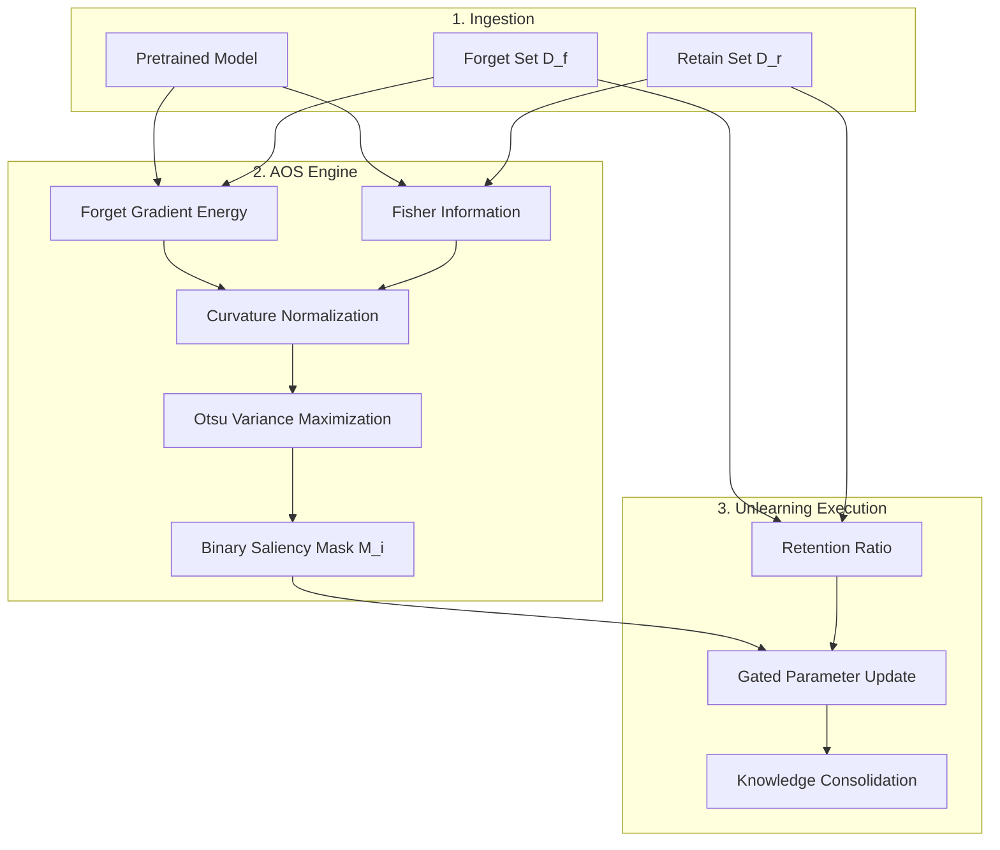

# Adaptive Otsu Unlearning (AOS)

[](https://opensource.org/licenses/MIT)
[](https://www.python.org/downloads/)
[](https://pytorch.org/)
[](https://www.auckland.ac.nz/)

> **Paper**: *Adaptive Otsu Unlearning: A Variance-Aware Framework for Stable and Interpretable Machine Unlearning (2025)*  
> **Authors**: [Neel Jani](mailto:njan320@aucklanduni.ac.nz) and [Gurudas Salunke](mailto:gsal919@aucklanduni.ac.nz)  
> **Affiliation**: Department of Computer Science, University of Auckland, New Zealand  

Official PyTorch implementation of **Adaptive Otsu Saliency (AOS)**, an automated, variance-maximizing machine unlearning framework. AOS dynamically computes layer-specific saliency thresholds using Otsu's method, eliminating the need for brittle, manual hyperparameter tuning (like in SalUn). 

---

## 🚀 Key Improvements over SalUn (ICLR 2024 Spotlight)

AOS is built as a direct extension of **SalUn** ([Fan et al., 2024](https://arxiv.org/abs/2310.12508)), replacing its static, global saliency threshold with a **dynamic, layer-wise statistical formulation**. 

At a **50% forget ratio** on CIFAR-100 (ResNet-18), AOS delivers:
- 📈 **+6.2% Retain Accuracy** (83.4% vs 77.2%)
- 📉 **-37% Stability Variance** (0.014 vs 0.024)
- ⚡ **-8% Runtime** due to faster convergence

| Feature | Original SalUn | AOS (Ours) | Benefit |
| :--- | :--- | :--- | :--- |
| **Thresholding** | Static, global $\tau$ | **Adaptive Otsu** | Adapts to layer capacity without grid search |
| **Curvature** | Raw gradient | **Fisher-weighted** | Dampens updates in high-curvature directions |
| **Scaling** | Fixed step size | **Dynamic ($\lambda_c$)** | Preserves representations shared between classes |
| **Dynamics** | Fixed throughout | **Annealing** | Stabilizes early optimization phases |

---

## 🛠️ Installation

```bash
# Clone the repository
git clone https://github.com/NeelJani1/AOS.git
cd AOS

# Option A: Conda (Recommended)
conda env create -f environment.yml
conda activate aos

# Option B: Pip
python -m venv .venv
source .venv/bin/activate
pip install -r requirements.txt
```

---

## ⚡ Quickstart

### Image Classification (CIFAR-100 / ResNet-18)
```bash
cd Classification
# 1. Train baseline model
python main_train.py --arch resnet18 --dataset cifar100 --epochs 100 --lr 0.1 --save_dir ./weights

# 2. Run AOS unlearning
python main_unlearning.py --arch resnet18 --dataset cifar100 --model_path ./weights/resnet18_cifar100.pth

# 3. Evaluate Unlearned Model & MIA
python evaluate_model.py --model_path ./results/unlearned_model.pt --forget_perc 0.1
python evaluate_all_mia.py --dataset cifar100 --arch resnet18
```

<details>
<summary><b>Generative Diffusion Unlearning (DDPM)</b></summary>

```bash
cd DDPM
python train.py --config configs/cifar10_train.yml
python train.py --config configs/cifar10_saliency_unlearn.yml
python quick_eval.py --config configs/cifar10_sample.yml
python classifier_evaluation.py
```
</details>

<details>
<summary><b>Stable Diffusion Concept Erasure</b></summary>

```bash
cd SD
python train-scripts/train-esd.py --prompt "nudity" --train_method "noxattn" --devices "0,0"
python eval-scripts/generate-images.py --prompts prompts/test_prompts.csv
python eval-scripts/compute-fid.py
```
</details>

---

## 🧠 Methodology & Architecture

AOS integrates three key mechanisms to achieve stable unlearning:
1. **Layer-wise Otsu Thresholding:** Isolates salient weights by maximizing between-class variance $\sigma_B^2(\tau)$.
2. **Fisher-Weighted Normalization:** Scales raw saliency $s_i$ by empirical Fisher Information $F_i$.
3. **Retention-Aware Scaling:** Modulates update magnitude $\lambda_c$ using forget vs. retain gradient energy.

### End-to-End Pipeline



### Algorithm Summary
```python
# Pseudo-code for Adaptive Otsu Unlearning (AOS)
for epoch in range(epochs):
    # Phase A: Saliency & Curvature
    saliency = compute_gradient_energy(model, D_f)
    fim = compute_fisher_information(model, D_r)
    s_norm = saliency / torch.sqrt(fim + epsilon)
    
    # Phase B: Otsu Variance Maximization
    for layer in model.layers:
        tau_otsu = get_otsu_threshold(s_norm[layer])
        tau_active = anneal(tau_otsu, tau_init, epoch)
        mask[layer] = s_norm[layer] > tau_active
        
    # Phase C: Gated Update
    lambda_c = compute_retention_scale(model, D_r, D_f)
    model.weights += lr * lambda_c * mask * compute_forget_grads(model, D_f)
    
    # Phase D: Retain Consolidation
    model = sgd_retain_step(model, D_r)
```

---

## 📊 Comprehensive Results

<details>
<summary><b>Click to expand full benchmark tables (CIFAR-100)</b></summary>

### Table III: Comprehensive Method Comparison (ResNet-18)
| Forget % | FT Test (↑) | FT Forget (↓) | FT Retain (↑) | GA Test (↑) | GA Forget (↓) | GA Retain (↑) | RL Test (↑) | RL Forget (↓) | RL Retain (↑) |
| :---: | :---: | :---: | :---: | :---: | :---: | :---: | :---: | :---: | :---: |
| **10%** | 55.29 | 57.26 | 61.57 | 62.31 | 81.88 | 83.08 | 54.06 | 55.80 | 60.21 |
| **20%** | 55.09 | 56.92 | 63.96 | 21.26 | 25.01 | 25.43 | 53.75 | 53.92 | 61.62 |
| **50%** | 53.64 | 55.04 | 65.68 | 1.00 | 0.96 | 1.06 | 53.60 | 54.04 | 65.86 |
| **80%** | 46.43 | 48.34 | 70.33 | 1.03 | 1.03 | 0.93 | 47.62 | 48.65 | 67.18 |
*(See paper for complete 10%-90% results)*

### Table IV: Ablation Study at 50% Forget Ratio
| Variant | Description | Forget Acc (%) (↓) | Retain Acc (%) (↑) | Variance (σ²) (↓) |
| :--- | :--- | :---: | :---: | :---: |
| **SalUn Baseline** | Fixed static threshold τ | 8.3 | 77.2 | 0.024 |
| **AOS-T** | Otsu Thresholding Only | 8.0 | 80.6 | 0.018 |
| **AOS-F** | Fisher Normalization Only | 7.9 | 81.8 | 0.016 |
| **AOS-R** | Retention Scaling Only | 8.2 | 82.5 | 0.015 |
| **AOS (Full)** | Complete Framework | **7.8** | **83.4** | **0.014** |

</details>

---

## 📁 Repository Structure
- `Classification/`: Image classification unlearning (ResNet-18, VGG)
- `DDPM/`: Generative unlearning (Classifier-Free Guidance DDPM)
- `SD/`: Stable Diffusion concept erasure
- `images/`: Architectural schematics and plots

---

## 📜 Citation & License

```bibtex
@article{jani2025adaptive,
  title={Adaptive Otsu Unlearning: A Variance-Aware Framework for Stable and Interpretable Machine Unlearning},
  author={Jani, Neel and Salunke, Gurudas},
  journal={Department of Computer Science, University of Auckland},
  year={2025}
}
```
Licensed under the [MIT License](LICENSE).
